# Documentación del Proyecto — RetailMax

Este documento reúne el modelo de datos, las tablas del modelo dimensional y la evidencia del despliegue de infraestructura vía Terraform.

## 📊 Modelo Entidad-Relación

Vista general del modelo de datos de RetailMax:

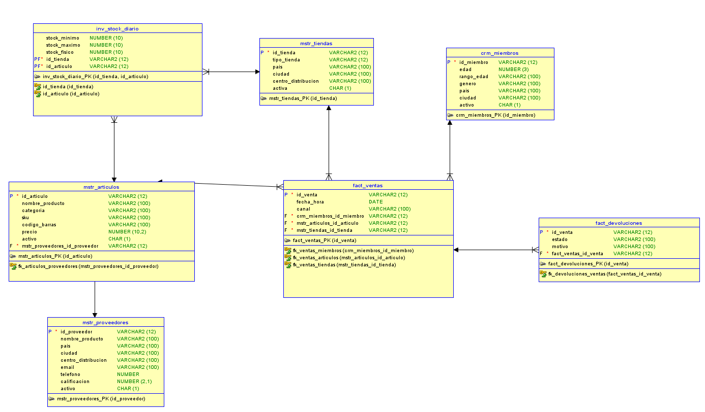

---

## 🗂️ Tablas del Modelo

### Tabla de Hechos: Ventas
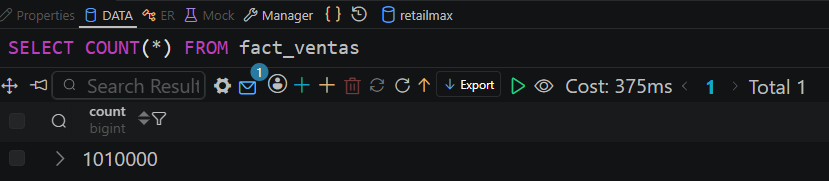

### Tabla de Hechos: Devoluciones
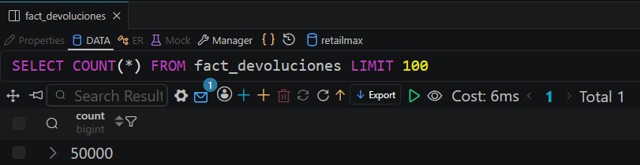

### Tabla de Hechos: Stock Diario (Inventario)
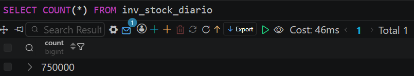

### Tabla Maestra: Artículos
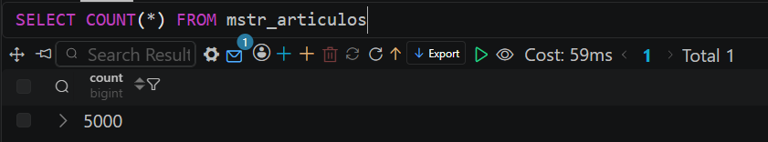

### Tabla Maestra: Proveedores
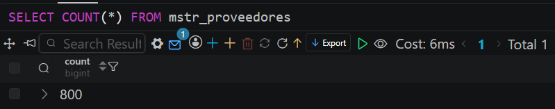

### Tabla Maestra: Tiendas
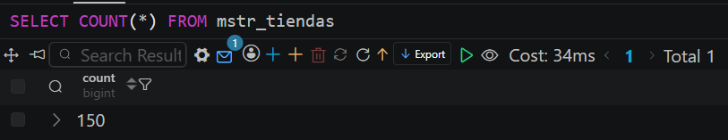

### CRM: Miembros
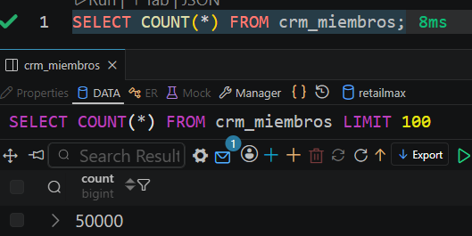

---

## ⚙️ Scripts personalizados

El archivo [`dr_custom_scripts.xml`](dr_custom_scripts.xml) contiene los scripts custom utilizados en el proceso de DR (Disaster Recovery) / carga de datos.

---

## 🚀 Despliegue con Terraform

Evidencia de la ejecución de `terraform apply` para el aprovisionamiento de la infraestructura:

### Paso 1
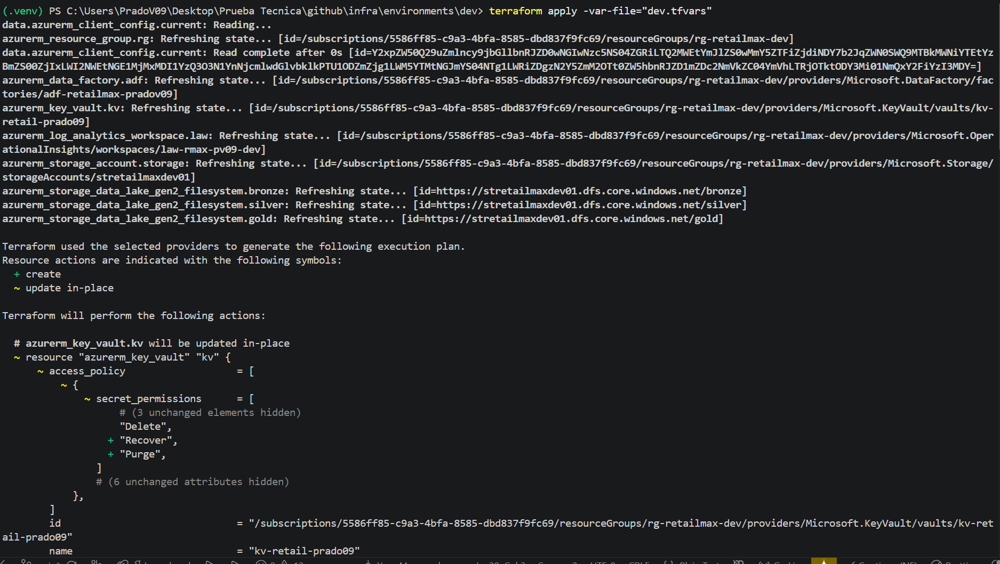

### Paso 2
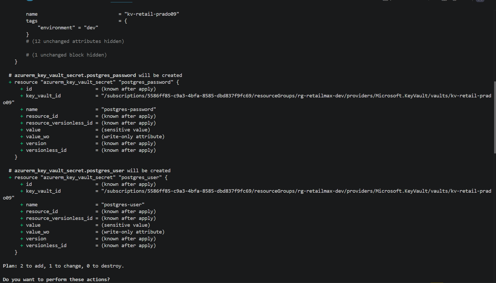

### Paso 3
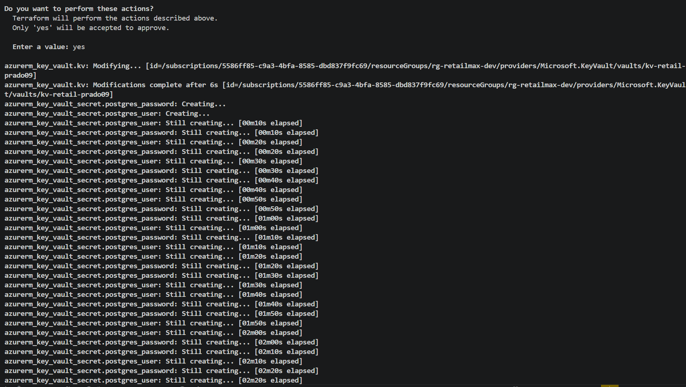

### Paso 4 — Aplicación finalizada
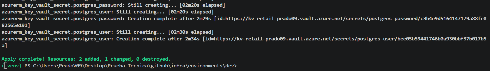

---

## 📁 Estructura de esta carpeta

```
docs/
├── README.md
├── a/
├── crm_miembros.png
├── dr_custom_scripts.xml
├── fact_devoluciones.png
├── fact_ventas.png
├── inv_stock_diario.png
├── modelo_entidad_relacion_retailmax.png
├── mstr_articulos.png
├── mstr_proveedores.png
├── mstr_tiendas.png
├── terraform_apply_1.png
├── terraform_apply_2.png
├── terraform_apply_3.png
└── terraform_apply_4.png
```

> Nota: al usar rutas relativas (`./imagen.png`), este README debe permanecer dentro de la carpeta `docs/` junto a las imágenes para que se rendericen correctamente tanto en GitHub como en local.